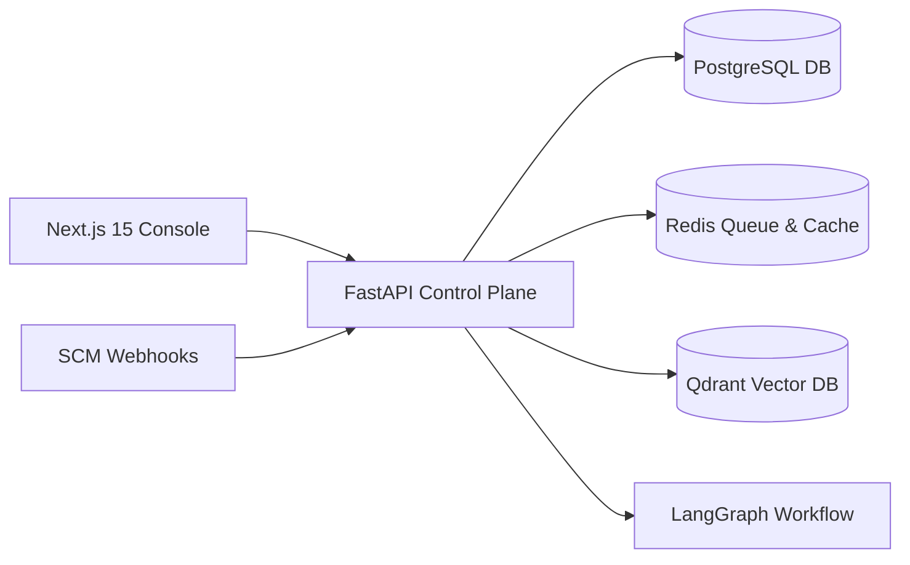
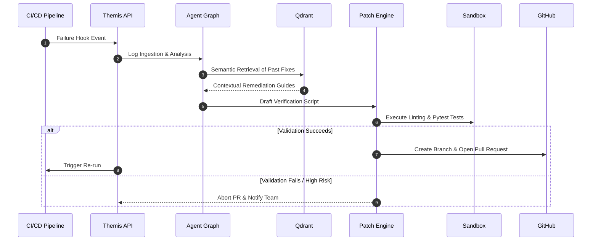

<div align="center">
  <h1>⚖️ Themis</h1>
  <p><strong>Next-Gen Autonomous DevOps Remediation & Fleet Platform</strong></p>
  <p>Detect, investigate, validate, and autonomously recover from CI/CD pipeline failures with a multi-agent troubleshooting workflow, Retrieval-Augmented Remediation (RAG), and multi-tenant fleet management.</p>
</div>

---

## Key Capabilities

- ** Incident Memory Engine (RAG)**: Automatically creates vector embeddings for historical pipeline incidents. High-similarity searches via Qdrant quickly locate and retrieve successful past patches to inform current failure resolutions.
- ** LangGraph Multi-Agent Investigation**: Orchestrates a stateful graph of specialized agents:
  1. _Classifier Agent_: Identifies the type of failure (e.g., dependency mismatches, configuration errors).
  2. _Root Cause Agent_: Extracts exact file, line, and log contexts.
  3. _Retriever Agent_: Queries past incident vectors for candidate fixes.
  4. _Fix Generator Agent_: Formulates precise diff proposals.
  5. _Reporter Agent_: Compiles structured confidence-scored markdown remediation summaries.
- ** Sandbox Patch Validation**: Before opening repository pull requests, the system sets up isolated sandboxed execution areas to run target syntax linting (`ruff`) and verify scripts (`pytest`) to prevent regressions.
- ** Self-Healing Workflows**: When a webhook notifies Themis of a build failure, the background workflow automates the cycle: Analyze log $\rightarrow$ Retrieve fix $\rightarrow$ Sandbox test patch $\rightarrow$ Create branch and open GitHub pull request $\rightarrow$ Simulate recovery.
- ** Multi-Tenant Organizations**: Real enterprise SaaS topology featuring structured Organizations, Teams, Projects, and Roles.
- ** Repository Fleet Management**: Organization-level control plane managing hundreds of codebases with cross-repository telemetry, aggregated failure risk distributions, and MTTR analytics.

---

##  Architecture & Flow

### System Overview



### Self-Healing Pipeline



---

##  Repository Structure

The platform is designed as a unified monorepo structure:

```text
├── apps/
│   ├── api/            # FastAPI Backend (Python, SQLAlchemy, Alembic, LangGraph)
│   └── web/            # Next.js 15 Console Dashboard (TypeScript, TailwindCSS)
├── packages/
│   ├── shared/         # Common libraries
│   ├── types/          # Global TypeScript interfaces
│   └── ui/             # Reusable styling & interface components
├── infrastructure/     # Deployment configurations
└── scripts/            # Linting, formatting, and helper utilities
```

---

##  Local Development

### Prerequisites

- Node.js v18+
- Python 3.12+
- Docker and Docker Compose (to run databases)

### 1. Initialize Environments

Clone the repository and set up environment configurations:

```bash
cp .env.example .env
```

Ensure your `.env` contains:

- Database connectivity (`DATABASE_URL`, `REDIS_URL`, `QDRANT_URL`)
- AI Credentials (`OPENAI_API_KEY`)
- Repository Integration (`GITHUB_TOKEN`, `GITHUB_WEBHOOK_SECRET`)

### 2. Start Infrastructure

Launch core database and caching instances:

```bash
docker compose up -d postgres redis qdrant
```

### 3. Run Backend API

Create a python virtual environment, install dependencies, and run the FastAPI server:

```bash
cd apps/api
python3 -m venv .venv
source .venv/bin/activate
pip install -r requirements.txt
alembic upgrade head
PYTHONPATH=. uvicorn app.main:app --reload --port 8000
```

### 4. Run Frontend Console

Install npm packages and run the Next.js development server:

```bash
npm install
npm run dev --workspace=@themis/web
```

Open [http://localhost:3000](http://localhost:3000) to view the console.

---

##  Verification & Testing

### Running API Unit Tests

Ensure you are in the python virtual environment inside the `apps/api` directory:

```bash
PYTHONPATH=. pytest
```

### Running Linters & Formatters

Check style and layout consistency:

```bash
# Python
ruff check app
ruff format app --check

# Frontend & Monorepo
npm run lint
```
