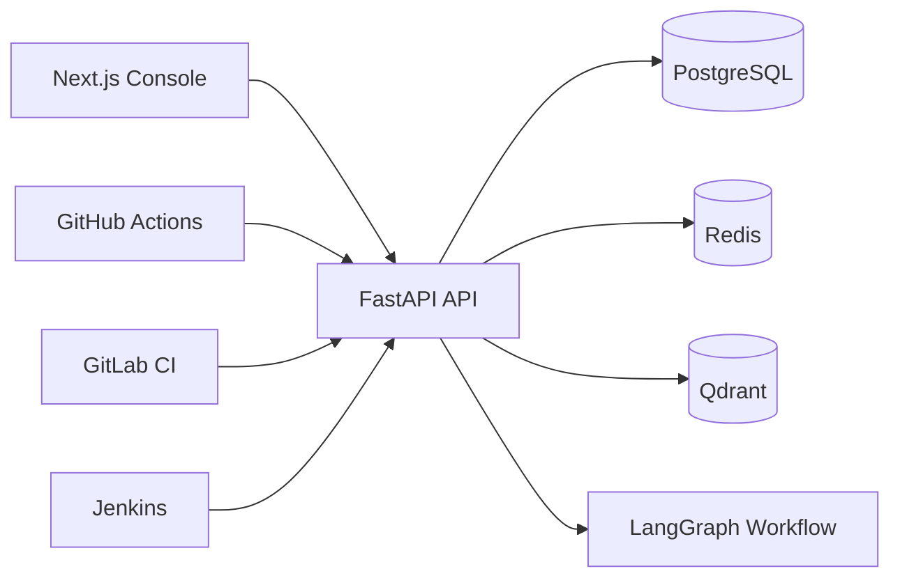
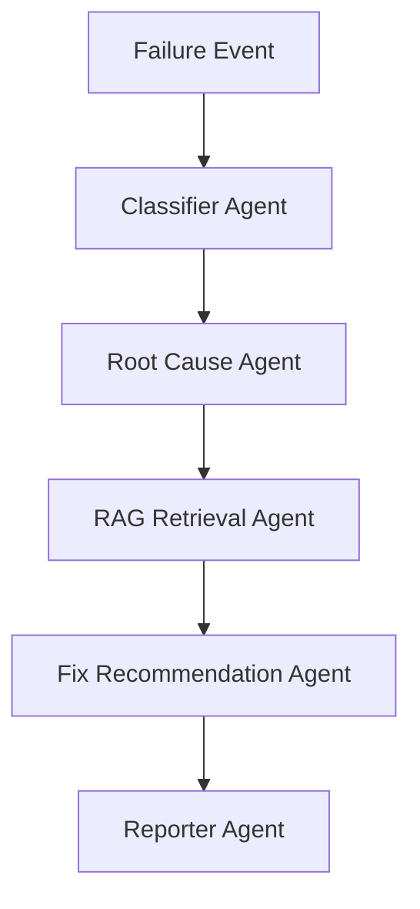

# Themis Architecture

Themis is structured as a horizontally scalable SaaS platform with a typed Next.js console, a FastAPI control plane, PostgreSQL persistence, Redis caching and queue primitives, Qdrant vector retrieval, and LangGraph-based agent orchestration.

## Agent Workflow

## Backend Boundaries

- `auth`: JWT issuance and future enterprise identity integration.
- `users`: user lifecycle and RBAC foundation.
- `repositories`: SCM repository inventory.
- `pipelines`: CI/CD pipeline and run ingestion.
- `incidents`: failure case management and analysis records.
- `agents`: LangGraph workflow orchestration.
- `rag`: embedding, vector search, retrieval, and reranking interfaces.
- `notifications`: delivery foundation for alerts and reports.
- `analytics`: operational and executive metrics.
